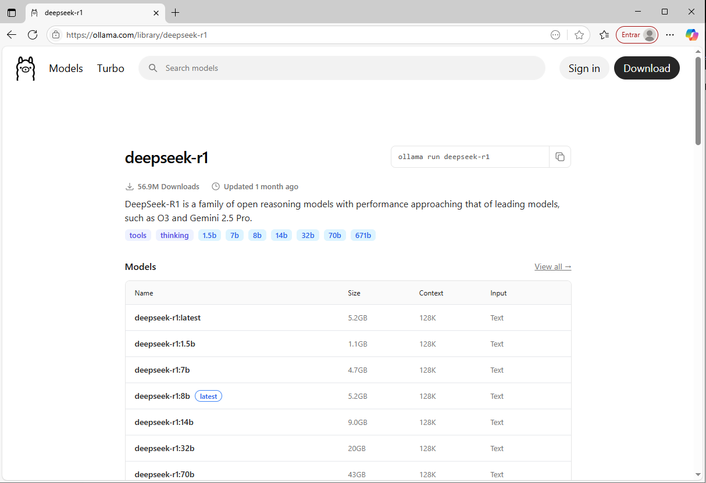
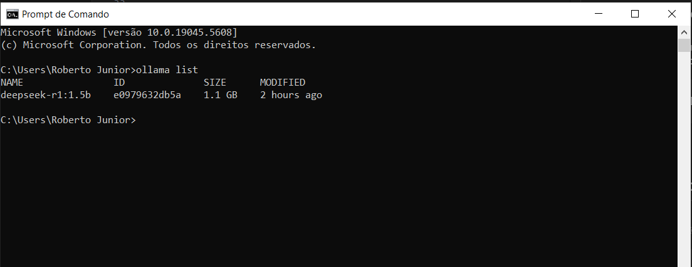
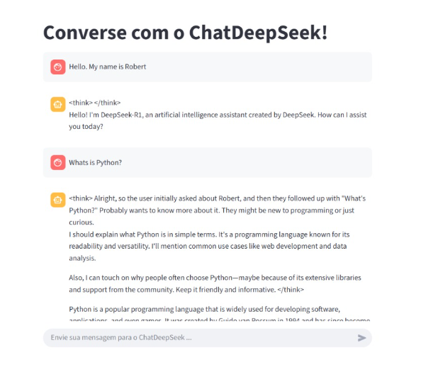

# Chat DeepSeek com Streamlit e Ollama
Este projeto aborda a forma de como rodar localmente um modelo LLM com **Ollama** e integrar a um chat interativo construido com o **Streamlit**.<br><br>
Este projeto foi desenvolvido utilizando o modelo `deepseek-r1:1.5b` via `langchain_ollama`.

## Pré-requisitos

- Python 3.10 ou superior
- [Ollama](https://ollama.com/download) instalado e rodando localmente.
- Modelo `deepseek-r1:1.5b` baixado no Ollama:

  ```bash
  ollama pull deepseek-r1:1.5b
<br>

## Baixando e Instalando a LLM Localmente
### 1. Baixe e instale o Ollama
- ### [Baixe o Ollama aqui !](https://ollama.com/download)

### 2. Clone um modelo LLM p/ o Ollama
#### Ao abrir o site do [Ollama](https://ollama.com/download), podemos visualizar diversos modelos LLMs disponíveis para download. 

#### Você deve escolher um que lhe atenda e que seja compatível com sua máquina local.
#### Para fazer o download, basta digitar conforme as instruções abaixo no terminal de sua máquina
```bash
  ollama pull <-nome-do-modelo->
  
  #Exemplo
  ollama pull deepseek-r1:1.5b
```
### 3. Executando o modelo clonado
#### Para executar o modelo clonado, deve-se passar o comando abaixo no terminal:
```bash
  ollama run <-nome-do-modelo->
  
  #Exemplo
  ollama run deepseek-r1:1.5b
```

### 4. Visualização de modelos em execução
#### É possível visualizar os modelos que estão sendo executados via terminal utilizando os comandos abaixo:
```bash
  ollama list
```
#### O terminal irá retornar uma mensagem semelhanete a esta.

<br>

## Instalação do ChatDeepSeek

### 1. Clone este repositório:
```bash
git clone https://github.com/robertojunior1202/deepseek-local-chat.git
cd deepseek-local-chat
```
### 2. Crie um ambiente virtual e ative-o:
```bash
python -m venv .venv
source .venv/bin/activate  # Linux/Mac
.venv\Scripts\activate     # Windows
```
### 3. Instale as dependências:
```bash
pip install -r requirements.txt
```

---

### 4. **Execução**

4.1. Certifique-se que o Ollama está rodando:
   ```bash
   ollama serve
```
4.2. Inicie a aplicação Streamlit:
   ```bash
   streamlit run app.py
```
4.3. Abra o navegador:
   ```bash
   http://localhost:8501
```

## Aplicação ChatDeepSeek
#### O ChatDeepSeek estará disponível conforme a imagem abaixo, onde você poderá realizar seus testes e pipelines de forma mais simples e visual.


## Tecnologias Utilizadas

- [Python](https://www.python.org/)
- [Streamlit](https://streamlit.io/)
- [Ollama](https://ollama.com/)
- [LangChain](https://www.langchain.com/)
- [Langchain-Ollama](https://python.langchain.com/docs/integrations/llms/ollama)


## Melhorias Futuras

- Suporte a múltiplos modelos.
- Ajuste dinâmico do tamanho de contexto.
- Histórico persistente em banco de dados.
- Modo "sem contexto" para respostas independentes.
